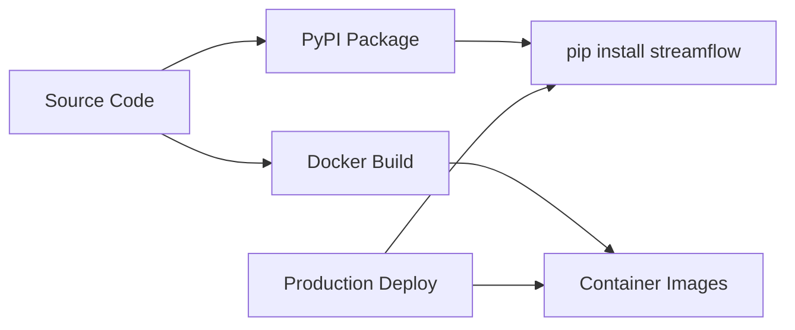

# 🐳 StreamFlow Docker Deployment Guide

## When and Where Docker Images Are Created

### 📋 **Current Status: Docker Images NOT Auto-Created**

**Important**: Docker images are **NOT automatically built** during PyPI packaging. They are separate deployment artifacts that need to be built independently.

## 🏗️ **Docker Image Creation Strategy**

### 1. **WHEN** Docker Images Are Created

Docker images are built at **deployment time**, not during PyPI packaging:



**Timing Options:**
- ✅ **Local Development**: `docker-compose up --build`
- ✅ **CI/CD Pipeline**: Automated builds on commits/releases
- ✅ **Manual Build**: Using provided scripts
- ✅ **Registry Pull**: Pre-built images from registry

### 2. **WHERE** Docker Images Are Built

#### Option A: **Local Development**
```bash
# Build all services locally
docker-compose build
docker-compose up
```

#### Option B: **Automated Script** (NEW)
```bash
# Build with version tag
./build_docker_images.sh v1.0.0

# Build and push to registry
./build_docker_images.sh v1.0.0 your-registry.com
```

#### Option C: **CI/CD Pipeline**
- GitHub Actions (`.github/workflows/ci-cd.yml`)
- Docker Hub automated builds
- Private registry builds

#### Option D: **Manual Individual Builds**
```bash
# Build specific service
docker build -t streamflow-ingestion:latest -f docker/ingestion/Dockerfile .
docker build -t streamflow-analytics:latest -f docker/analytics/Dockerfile .
```

### 3. **HOW** Docker Images Are Configured

## 📦 **Docker Configuration Structure**

```
📁 docker/
├── ingestion/
│   └── Dockerfile              # Event ingestion service
├── analytics/
│   └── Dockerfile              # Analytics processing service  
├── alerting/
│   └── Dockerfile              # Alert management service
├── dashboard/
│   └── Dockerfile              # Dashboard API service
├── storage/
│   └── Dockerfile              # Data storage service
├── nginx/
│   └── nginx.conf              # Reverse proxy config
└── prometheus/
    ├── prometheus.yml          # Monitoring config
    └── alert_rules.yml         # Alert rules
```

## 🚀 **Docker Deployment Methods**

### Method 1: **Development with Docker Compose**

```bash
# Start all services
docker-compose up

# Build and start
docker-compose up --build

# Start specific services
docker-compose up ingestion analytics
```

**Services Started:**
- **Infrastructure**: PostgreSQL, RabbitMQ, Redis
- **StreamFlow**: Ingestion, Analytics, Alerting, Dashboard, Storage
- **Monitoring**: Prometheus, Grafana
- **Proxy**: Nginx

### Method 2: **Production with Docker Swarm**

```bash
# Initialize swarm
docker swarm init

# Deploy stack
docker stack deploy -c docker-compose.yml streamflow
```

### Method 3: **Kubernetes Deployment**

```bash
# Convert docker-compose to k8s (using kompose)
kompose convert

# Deploy to Kubernetes
kubectl apply -f .
```

### Method 4: **Individual Service Containers**

```bash
# Run specific service
docker run -d \
  --name streamflow-ingestion \
  -p 8001:8000 \
  -e DATABASE_URL="postgresql://..." \
  -e RABBITMQ_URL="amqp://..." \
  streamflow-ingestion:latest
```

## 🔄 **PyPI Package vs Docker Images**

| Aspect | PyPI Package | Docker Images |
|--------|-------------|---------------|
| **Purpose** | Python library/CLI tool | Complete runtime environment |
| **Installation** | `pip install streamflow` | `docker pull streamflow-*` |
| **Usage** | `import streamflow` | `docker run streamflow-*` |
| **Dependencies** | Python packages only | OS + Python + packages |
| **Deployment** | Local/development | Production containers |
| **Size** | 50KB (wheel) + deps | ~200-500MB per service |

## 🛠️ **Building Docker Images**

### Quick Start (All Services)

```bash
# Build all images with latest tag
./build_docker_images.sh

# Build with specific version
./build_docker_images.sh v1.0.0

# Build and push to registry
./build_docker_images.sh v1.0.0 docker.io/yourusername
```

### Manual Build Process

```bash
# 1. Build infrastructure (uses pre-built images)
docker-compose pull postgres rabbitmq redis

# 2. Build StreamFlow services
docker-compose build ingestion
docker-compose build analytics  
docker-compose build alerting
docker-compose build dashboard
docker-compose build storage

# 3. Start all services
docker-compose up -d
```

### CI/CD Integration

The project includes GitHub Actions workflow (`.github/workflows/ci-cd.yml`) that:

1. **Builds** Docker images on every commit
2. **Tests** the containers
3. **Pushes** to registry on releases
4. **Deploys** to staging/production

## 📊 **Docker Image Sizes & Architecture**

### Multi-Stage Builds (Optimized)

Each Dockerfile uses multi-stage builds:

```dockerfile
# Build stage - ~800MB
FROM python:3.11-slim as builder
# ... install build dependencies
# ... compile packages

# Production stage - ~200MB  
FROM python:3.11-slim
# ... copy only compiled packages
# ... minimal runtime dependencies
```

### Expected Image Sizes

| Service | Base Size | With Dependencies | Production |
|---------|-----------|-------------------|------------|
| Ingestion | ~50MB | ~200MB | ~180MB |
| Analytics | ~50MB | ~220MB | ~200MB |
| Alerting | ~50MB | ~180MB | ~160MB |
| Dashboard | ~50MB | ~200MB | ~180MB |
| Storage | ~50MB | ~190MB | ~170MB |

## 🔧 **Configuration for Different Environments**

### Development
```bash
# Use docker-compose.yml
docker-compose up
```

### Staging
```bash
# Use environment-specific overrides
docker-compose -f docker-compose.yml -f docker-compose.staging.yml up
```

### Production
```bash
# Use production configurations
docker-compose -f docker-compose.yml -f docker-compose.prod.yml up
```

## 🚨 **Important Notes**

### 1. **PyPI vs Docker Separation**
- **PyPI Package**: For developers who want to use StreamFlow as a library
- **Docker Images**: For operations teams deploying the full system

### 2. **Source Code Location**
Docker images are built from the **original structure** (`services/`, `shared/`), not the PyPI package structure.

### 3. **Registry Strategy**
Consider pushing images to:
- **Docker Hub**: `docker.io/yourusername/streamflow-*`
- **GitHub Container Registry**: `ghcr.io/yourusername/streamflow-*`
- **AWS ECR**: `your-account.dkr.ecr.region.amazonaws.com/streamflow-*`
- **Private Registry**: `your-registry.com/streamflow-*`

## 🎯 **Quick Commands Summary**

```bash
# Build all images
./build_docker_images.sh

# Start development environment
docker-compose up

# Build specific service
docker build -t streamflow-ingestion -f docker/ingestion/Dockerfile .

# Check running containers
docker ps

# View logs
docker-compose logs ingestion

# Scale services
docker-compose up --scale analytics=3

# Stop all services
docker-compose down
```

## 🔄 **Integration with PyPI Package**

The Docker containers can **optionally** use the PyPI package:

```dockerfile
# Option 1: Install from PyPI (after publishing)
RUN pip install streamflow

# Option 2: Install from local code (current approach)
COPY . /app
RUN pip install -e .
```

This creates a flexible deployment strategy where users can:
- **Develop**: Use PyPI package locally
- **Deploy**: Use Docker containers in production
- **Hybrid**: Mix both approaches as needed

🎉 **Docker images provide the complete production-ready deployment solution for StreamFlow!**